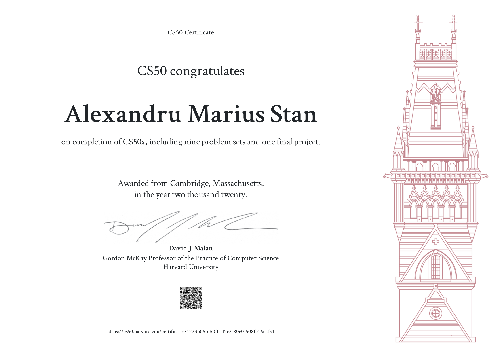

### Welcome to CS50x!

CS50 is one of Harvard's most popular Computer Science courses out there. As per their description:

```
Introduction to the intellectual enterprises of computer science and the art of programming. This course teaches students how to think algorithmically and solve problems efficiently. Topics include abstraction, algorithms, data structures, encapsulation, resource management, security, and software engineering. Languages include C, Python, and SQL plus students’ choice of: HTML, CSS, and JavaScript (for web development); Java or Swift (for mobile app development); or Lua (for game development). Problem sets inspired by the arts, humanities, social sciences, and sciences. Course culminates in a final project. Designed for concentrators and non-concentrators alike, with or without prior programming experience. Two thirds of CS50 students have never taken CS before. Among the overarching goals of this course are to inspire students to explore unfamiliar waters, without fear of failure, create an intensive, shared experience, accessible to all students, and build community among students.
```
[credits](https://cs50.harvard.edu/x/2020/)

#### Details

This course is free and open to anyone interested in doing it. Even the activities we should develop each week are graded and reviewed free of costs.

I`ve set up this repository to hold each and every project the students must complete.

##### Quick Navigation

Every week (or so) the respective module will be added and linked here, containing all the projects relative to it. The last commit of the project will be once all the requirements are fulfilled.

* [Week 1 - C](https://github.com/alexstan12/CS50-PSETS/tree/main/pset1)
* [Week 2 - Arrays](https://github.com/alexstan12/CS50-PSETS/tree/main/pset2)
* [Week 3 - Algorithms](https://github.com/alexstan12/CS50-PSETS/tree/main/pset3)
* [Week 4 - Memory](https://github.com/alexstan12/CS50-PSETS/tree/main/pset4)
* [Week 5 - Data Structures](https://github.com/alexstan12/CS50-PSETS/tree/main/pset5/speller)
* [Week 6 - Python](https://github.com/alexstan12/CS50-PSETS/tree/main/pset6)
* [Week 7 - SQL](https://github.com/alexstan12/CS50-PSETS/tree/main/pset7)
* [Week 8 - Web Track](https://github.com/alexstan12/CS50-PSETS/tree/main/pset8)
* [Week 9 - Final Project](https://github.com/alexstan12/route50)

---

# Certificate

After submitting every challenge presented on the course, any student that achieves 70% or more on every project is eligible to a certificate. 
I've proudly worked on every problem set and made a final project that I can call my very own.



Great inspiration for this README structure : https://github.com/fabiosenracorrea/CS50
